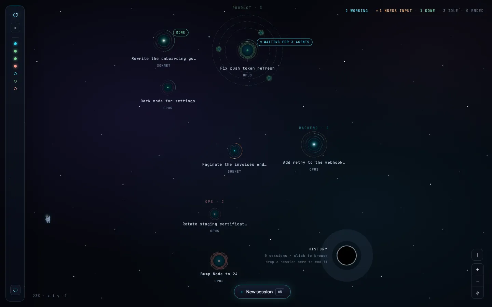

# Orbital

Orbital is a local web app that visualizes and manages your Claude Code
sessions as a 2D space map: sessions are planets, subagents are orbiting
moons. It shows live terminal sessions (read-only) alongside full session
history, lets you organize sessions with tags and auto-tag rules, and can
spawn and drive its own sessions through the Claude Agent SDK — a full chat
with Claude from the browser, including resuming and continuing historical
sessions. It runs only on your own machine, binds to `127.0.0.1`, and every request
must carry a token only your user can read (see [SECURITY.md](SECURITY.md)).

Moons appear only around sessions Orbital started itself. A terminal session's
transcript records a subagent only once it has finished, so there is no moment
at which its running subagents can be read —
[`docs/domains/subagents-in-transcripts.md`](docs/domains/subagents-in-transcripts.md)
has the measurements.

## Why Orbital

Orbital is meant to replace the Claude Code CLI for anyone running several
sessions at once, and to do it calmly: nothing blinks, a session waiting for
you is not an alarm, there is no sound unless you turn it on, and nothing
ends behind your back. [`docs/why-orbital.md`](docs/why-orbital.md) has the
principles in full.

## Screenshot



## Prerequisites

- Node.js 24+
- The [Claude Code CLI](https://docs.claude.com/en/docs/claude-code) installed
  and logged in. Orbital's web sessions run through the Claude Agent SDK and
  bill your Claude subscription via the CLI's own OAuth session — not an API
  key (see [Billing](#billing) below).
- A `~/.claude` directory populated by normal Claude Code CLI use (Orbital
  reads its project/session transcripts from there; see
  [A note on `~/.claude`](#a-note-on-claude) below).

## Install

```bash
npm install
```

One install at the root covers all six npm workspaces:

| workspace | what it is |
|---|---|
| `shared` | what the Mac, the relay and the phone agree on: keys, frames, message shapes |
| `server` | the local API and WebSocket; watches `~/.claude` and runs the sessions Orbital starts |
| `web` | the React frontend, including the phone UI in `web/src/mobile` |
| `desktop` | the Electron shell for macOS |
| `relay` | the blind relay between a Mac and its paired phones, shipped as a Docker image |
| `mobile` | the Capacitor shell for Android around `web/src/mobile` |

## Run

Orbital is two processes: the server (API + WebSocket + the process that
watches `~/.claude` and drives spawned sessions) and the web frontend (Vite
dev server, which proxies `/api` and `/ws` to the server).

Start both with one command:

```bash
npm run dev             # server (http://127.0.0.1:4838) + web (http://127.0.0.1:4839)
```

Or each in its own terminal:

```bash
npm run dev:server
npm run dev:web
```

Open `http://localhost:4839`.

## Desktop app (macOS)

The `desktop/` workspace wraps the same web app in an Electron shell: one
window, and native macOS notifications that you can click to jump straight back
to the session they are about. It never starts `tsx` or `vite` — it either
attaches to an Orbital server that is already answering on the port, or forks
the built server bundle itself, so the app and a running `npm run dev` share
one database and one watcher instead of fighting over them.

In development, with `npm run dev` already running in another terminal:

```bash
npm run dev:desktop      # window at http://localhost:4839, HMR intact
```

To build the installable app:

```bash
npm run desktop:release     # → desktop/release/Orbital-<version>-arm64.dmg
```

Always run that from the repo root: it builds the server and the web app first,
where `npm run dist -w desktop` on its own would package whatever stale output
happens to be lying in `server/dist` and `web/dist`.

macOS arm64 only. The release DMG is signed with a Developer ID and
notarized, so it opens with a plain double-click
([`docs/decisions/desktop-app-is-developer-id-signed.md`](docs/decisions/desktop-app-is-developer-id-signed.md)).
`npm run desktop:build` makes a local, un-notarized one instead. Enable
Orbital under **System Settings → Notifications** if macOS never offers the
permission prompt by itself.

The packaged app does **not** bundle a Claude Code CLI — it spawns the one
already installed on the Mac, so that the CLI writing transcripts and the
Orbital reading them are the same version (and so the app stays ~200 MB
smaller). It resolves your real `PATH` at startup to find it; if autodetection
picks the wrong one, the `claude_executable_path` setting overrides it.

[`docs/ops/run-the-desktop-app.md`](docs/ops/run-the-desktop-app.md) has the
forked-mode recipe, the notification smoke test and the troubleshooting table.

## Mobile remote

`relay/` is a small Fastify + `ws` service that lets a phone pair with
this Mac and drive Orbital's API over an end-to-end encrypted tunnel, for
deployment on Dokploy. The backend (relay, wire protocol in `shared/`,
and the Mac side in `server/src/remote/`) and the desktop's Settings →
Mobile (the switch, the pairing QR, the fingerprint confirmation, the
paired phones) are built. The phone app is `mobile/` (the Capacitor shell,
Android only) around `web/src/mobile/`: it pairs by scanning a QR or
pasting a code, then reads the session list and a session's transcript
(offline, unpaired and version-mismatch states included), replies through
the shared composer with photos from the camera or the gallery, answers
permission, plan and question cards, starts a new session, and notifies —
a local notification while it is connected, a generic push from the relay
through Firebase Cloud Messaging when it is not. iOS is not built yet. See
[`docs/ops/build-the-android-app.md`](docs/ops/build-the-android-app.md)
(including the Firebase files push needs). Off is the default.

```bash
npm run dev -w relay     # relay on :4840, SQLite under relay/data/
npm run dev:mobile -w @orbital/web   # the phone's UI in a browser, :4841
npm run build -w @orbital/mobile     # web mobile build + cap sync android
npm run apk -w @orbital/mobile       # debug APK
```

See [`docs/superpowers/specs/2026-09-30-mobile-remote-design.md`](docs/superpowers/specs/2026-09-30-mobile-remote-design.md)
for the design and [`docs/ops/run-the-relay.md`](docs/ops/run-the-relay.md)
for deploying it.

## Test

```bash
npm test -w server        # server test suite (Vitest)
npm run test:run -w web   # web test suite (Vitest + Testing Library), single run
npm run test -w web       # web test suite in watch mode
npm test -w desktop       # desktop test suite (Vitest, no Electron launched)
npm test                  # all three, in order
```

Type checking and the production web build:

```bash
npm run typecheck -w server
npm run typecheck -w web
npm run build -w web
```

## Lint and format

One flat ESLint config at the root covers every workspace; Prettier
formats and is not wired into ESLint
([`docs/decisions/eslint-and-prettier-side-by-side.md`](docs/decisions/eslint-and-prettier-side-by-side.md)).

```bash
npm run lint              # eslint, type-aware, whole repo
npm run lint:fix          # the autofixable subset
npm run format            # prettier --write
npm run format:check      # prettier --check
```

The repository has not been formatted yet, so `format:check` fails until
someone runs `npm run format` and commits the result on its own.

## Billing

A session you spawn or continue from Orbital's web UI runs through the
Claude Agent SDK, which prefers `ANTHROPIC_API_KEY` over CLI OAuth when the
key is present in the environment. Since Orbital's whole point is to drive
sessions billed against your existing Claude subscription (the same way the
CLI itself does) rather than pay-per-token API billing, the server **deletes
`ANTHROPIC_API_KEY` from its own environment on startup** unless you
explicitly opt in:

```bash
ORBITAL_USE_API_KEY=1 npm run dev:server
```

Only set that if you actually want spawned sessions billed to an API key
instead of your subscription.

## A note on `~/.claude`

Orbital reads and writes Claude Code CLI's on-disk state under `~/.claude`
(project transcripts, session `.jsonl` files, etc.) to build its session
list and live-tail running sessions. **These formats are undocumented,
internal details of the Claude Code CLI, not a public/stable API.** They can
change — or break Orbital — without notice when you update the CLI. If
Orbital stops seeing sessions after a CLI update, that's the likely cause.

## License

MIT — see [`LICENSE`](LICENSE).

Orbital is an independent project built on Anthropic's Claude Agent SDK. It
is not made, endorsed or supported by Anthropic. Claude and Claude Code are
trademarks of Anthropic.
